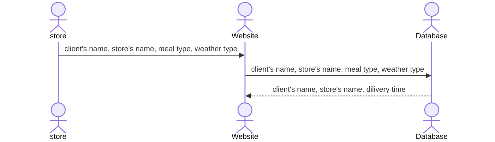

# QuickDelivery

[My Notes](notes.md)

## Introduction

This project is a food delivery management web application that helps merchants estimate delivery times based on food type and weather conditions. Merchants enter their store’s name to login, then enter a customer’s name, select the ordered food and current weather, and the backend calculates an estimated delivery time.

All orders are stored persistently and displayed on a separate dashboard showing customer names, merchant names and delivery times, allowing delivery personnel to easily view and manage deliveries. Every merchant also has the ability to clear all existing order records.

> [!NOTE]
> If you are not familiar with Markdown then you should review the [documentation](https://docs.github.com/en/get-started/writing-on-github/getting-started-with-writing-and-formatting-on-github/basic-writing-and-formatting-syntax) before continuing.

## 🚀 Specification Deliverable

> [!NOTE]
> Fill in this sections as the submission artifact for this deliverable. You can refer to this [example](https://github.com/webprogramming260/startup-example/blob/main/README.md) for inspiration.

For this deliverable I did the following. I checked the box `[x]` and added a description for things I completed.

- [ ] Proper use of Markdown
- [ ] A concise and compelling elevator pitch
- [ ] Description of key features
- [ ] Description of how you will use each technology
- [ ] One or more rough sketches of your application. Images must be embedded in this file using Markdown image references.

### Elevator pitch

Have you ever struggled to give an accurate delivery time when factors like food type and weather keep changing? QuickDeliver is designed to help food merchants make realistic delivery estimates without extra effort. Merchants enter basic order information, select the food being prepared, and account for current weather conditions, and the application calculates an expected delivery time automatically. Orders are then displayed on a shared courier dashboard, where drivers can see order details and delivery times at a glance. By simplifying time estimation and improving coordination, QuickDeliver helps deliveries run more smoothly for both merchants and couriers.

### Design

Here is a sequence diagram that shows how marchant would interact with the backend to place orders.

### Key features

1. Ability for merchant to enter the store’s name and the customer name
2. Ability for merchant to select the food items for the customer (three options: Pan-fried Bun, Mini Wontons with Shrimp & Water Chestnut, Dry/Fragrant Hot Pot Bullfrog)
3. Ability for merchant to select the current weather (three options: Hot & Humid, Cold & Damp, Rainy)
4. Backend calculates estimated delivery time based on food characteristics and weather
5. Display of the store’s name, customer names, and corresponding delivery times for each order on a dashboard
6. Ability for every merchant to delete all previous order records
7. Every merchant will get a notification when another merchant places a new order
8. Order information persistently stored.

### Technologies

I am going to use the required technologies in the following ways.

- **HTML** - 
 1. One for entering the store’s name
 2. One for order entry (select food items and weather, enter customer’s name)
 3. One for delivery dashboard displaying all orders, customer names, and estimated delivery times. Hyperlinks between pages for navigation.

- **CSS** - Application styling that is responsive and visually clear. Uses good whitespace, color choice, and contrast. Dashboard table for orders is easy to read on different screen sizes.
- **React** - Provides consumer name entry, store name entry, order entry, food and weather selection, and displays calculated delivery times. Reactive to merchant’s actions, dynamically updates the delivery dashboard when new orders are added or deleted. Component-based views for forms and dashboard.
- **Service** - Backend service with endpoints for:
 1. Retrieving food options and weather types
 2. Submitting new orders
 3. Calculating delivery times based on food characteristics and selected weather
 4. Retrieving current order for display on delivery dashboard
 5. Deleting all previous orders on merchant request
 6. Entering consumer’s name.
 7. Entering store’s name.
- **DB/Login** - DB (Database) – Stores order numbers, customer names, store names and calculated delivery times. Persistent storage ensures no data is lost on refresh.
- **WebSocket** - As orders are submitted or deleted, the delivery dashboard updates in real time for delivery personnel. When a store places an order, other stores get a notification.

## 🚀 AWS deliverable

For this deliverable I did the following. I checked the box `[x]` and added a description for things I completed.

- [ ] **Server deployed and accessible with custom domain name** - [My server link](https://yourdomainnamehere.click).

## 🚀 HTML deliverable

For this deliverable I did the following. I checked the box `[x]` and added a description for things I completed.

- [ ] **HTML pages** - I created three HTML pages. One for logging in, one for the merchants to choose the food types and weather types, one for the diaplay of the oder delivery time, store's name and oder number.
- [ ] **Proper HTML element usage** - I used tags to structure my web page, the user name diaplay is on the table page.
- [ ] **Links** - I have links to travel between pages, a link to my github, button can also tralvel between pages using action.
- [ ] **Text** - I have welcome text, logo text, weather choices, food choices etc.
- [ ] **3rd party API placeholder** - In the view order page, there is a place holder for a third party API text.
- [ ] **Images** - I have my image in the home page.
- [ ] **Login placeholder** - It's also in the home page.
- [ ] **DB data placeholder** - store names and passwords login. decide whether the name has already exist, whether the password is correct, whether the store has registered.
- [ ] **WebSocket placeholder** - once an order is placed on the choices page, everyone who is on the table page can see the information of the recently added order.

## 🚀 CSS deliverable

For this deliverable I did the following. I checked the box `[x]` and added a description for things I completed.

- [ ] **Visually appealing colors and layout. No overflowing elements.** - 1. consistent color scheme is implemented using CSS variables defined in the :root selector. 2. a gradient background and a glass-style card layout. 3. containers use fixed maximum widths and flexible layouts to ensure content does not overflow the viewport.
- [ ] **Use of a CSS framework** - 1. Bootstrap 5 is included to provide a responsive baseline and consistent default styling across browsers. 2. custom CSS is layered on top of the framework.
- [ ] **All visual elements styled using CSS** - 1. all visual presentation is handled through external CSS files. 2. Include: Typography, colors, spacing, layout, tables, navigation, hover effects, and cards.
- [ ] **Responsive to window resizing using flexbox and/or grid display** - I did not complete this part of the deliverable.
- [ ] **Use of a imported font** - I did not complete this part of the deliverable.
- [ ] **Use of different types of selectors including element, class, ID, and pseudo selectors** - I did not complete this part of the deliverable.

## 🚀 React part 1: Routing deliverable

For this deliverable I did the following. I checked the box `[x]` and added a description for things I completed.

- [ ] **Bundled using Vite** - I did not complete this part of the deliverable.
- [ ] **Components** - I did not complete this part of the deliverable.
- [ ] **Router** - I did not complete this part of the deliverable.

## 🚀 React part 2: Reactivity deliverable

For this deliverable I did the following. I checked the box `[x]` and added a description for things I completed.

- [ ] **All functionality implemented or mocked out** - I did not complete this part of the deliverable.
- [ ] **Hooks** - I did not complete this part of the deliverable.

## 🚀 Service deliverable

For this deliverable I did the following. I checked the box `[x]` and added a description for things I completed.

- [ ] **Node.js/Express HTTP service** - I did not complete this part of the deliverable.
- [ ] **Static middleware for frontend** - I did not complete this part of the deliverable.
- [ ] **Calls to third party endpoints** - I did not complete this part of the deliverable.
- [ ] **Backend service endpoints** - I did not complete this part of the deliverable.
- [ ] **Frontend calls service endpoints** - I did not complete this part of the deliverable.
- [ ] **Supports registration, login, logout, and restricted endpoint** - I did not complete this part of the deliverable.

## 🚀 DB deliverable

For this deliverable I did the following. I checked the box `[x]` and added a description for things I completed.

- [ ] **Stores data in MongoDB** - I did not complete this part of the deliverable.
- [ ] **Stores credentials in MongoDB** - I did not complete this part of the deliverable.

## 🚀 WebSocket deliverable

For this deliverable I did the following. I checked the box `[x]` and added a description for things I completed.

- [ ] **Backend listens for WebSocket connection** - I did not complete this part of the deliverable.
- [ ] **Frontend makes WebSocket connection** - I did not complete this part of the deliverable.
- [ ] **Data sent over WebSocket connection** - I did not complete this part of the deliverable.
- [ ] **WebSocket data displayed** - I did not complete this part of the deliverable.
- [ ] **Application is fully functional** - I did not complete this part of the deliverable.
